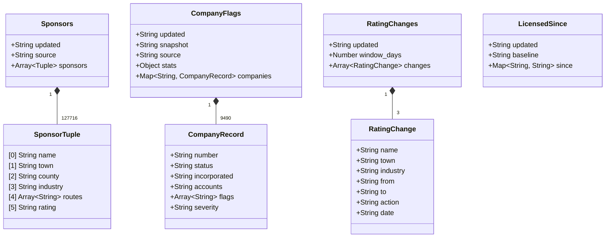
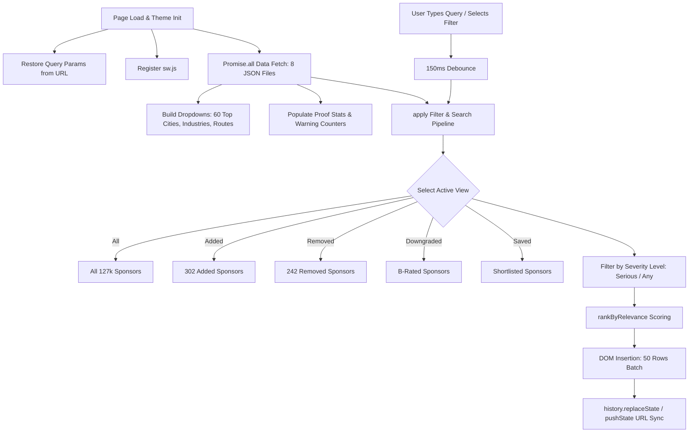
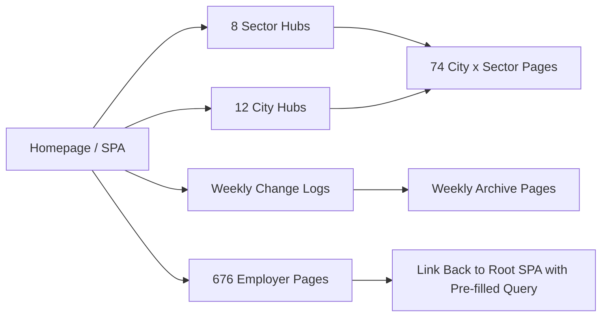
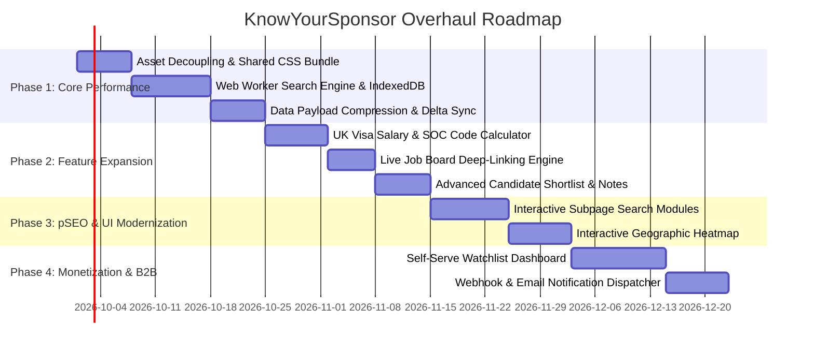

# KnowYourSponsor (`sponsorsignal`) — In-Depth Codebase & System Analysis

> **Document Version:** 1.0  
> **Repository Target:** `/data/data/com.termux/files/home/sponsorsignal`  
> **Status:** Read-Only Audit & Overhaul Blueprint  
> **Analysis Date:** September 2026  

---

## 1. Executive Summary & Product Mission

**KnowYourSponsor** (code repository: `sponsorsignal`, hosted on GitHub Pages at `roshan1208.github.io/sponsorsignal`) is a specialized UK immigration intelligence platform. It solves a critical asymmetry in the UK visa and hiring landscape:

1. **The Problem:** The UK Home Office publishes a daily register of 127,000+ organisations licensed to sponsor foreign workers (`Skilled Worker`, `Global Business Mobility`, `Creative Worker`, etc.). However, the government publication is a raw, flat CSV file. It lacks industry classifications, historical delta tracking (who gained or lost a licence), and company health cross-referencing. Crucially, holding a sponsor licence only proves an entity *can* sponsor; it does not prove the entity is solvent, trading, or in good standing.
2. **The Solution:** KnowYourSponsor ingests the register daily, normalizes records, runs heuristic industry classifications, tracks longitudinal changes (additions, revocations, A-to-B rating downgrades), and cross-references sponsors against **Companies House** corporate filing data. This immediately flags dissolved, liquidated, strike-off pending, or dormant entities.
3. **The Deployment Model:** A decoupled static distribution architecture. The raw ingestion and scraping pipelines run in a private core repository, and an automated GitHub Actions bot (`sponsorsignal-bot`) publishes optimized JSON payloads, RSS feeds, and a massive Programmatic SEO (pSEO) footprint (781 static HTML pages) to this repository.

```mermaid
graph TD
    subgraph Private Core Pipeline
        HO[UK Home Office Daily CSV] --> Ingest[Ingestion & Normalizer]
        CH[Companies House Bulk Data] --> Enrich[Company Matcher & Flags Engine]
        DB[(Longitudinal Snapshot DB)] --> Diff[Daily Delta & Ratings Engine]
        Diff --> Generator[Static Site & pSEO Page Generator]
    end

    Generator -->|Automated Publish via sponsorsignal-bot| PublicRepo[Public GitHub Pages Repository]

    subgraph Public Distribution (This Codebase)
        PublicRepo --> SPA[Interactive Search SPA (index.html)]
        PublicRepo --> Data[Data Subsystem (data/*.json)]
        PublicRepo --> pSEO[781 Programmatic SEO Pages]
        PublicRepo --> Feeds[22 RSS & Atom Feeds]
        PublicRepo --> PWA[PWA Shell & Service Worker]
    end

    User((Job Seekers & Recruiters)) --> SPA
    User --> pSEO
    User --> Feeds
```

---

## 2. Complete File Inventory & Directory Structure

The repository contains **820 files** organized into a static site distribution structure:

| Category | Count | File Types | Description |
| :--- | :--- | :--- | :--- |
| **Root Application** | 8 | `.html`, `.xml`, `.json`, `.js`, `.txt`, `.png` | Core interactive search app, PWA service worker, web manifest, root RSS feed, sitemap, robots, OpenGraph assets. |
| **Data Payloads** | 9 | `.json` (`data/`) | Core data files loaded asynchronously by client-side JS (totaling ~13.5MB uncompressed). |
| **Top-Level Informational Hubs** | 9 | `.html` | `/about/`, `/changes/`, `/data-api/`, `/insights/`, `/methodology/`, `/pricing/`, `/privacy/`, `/watchlist/`, `/employer/`. |
| **Historical Change Archives** | 2 | `.html` | `/changes/2026-W36/`, `/changes/2026-W37/`. |
| **Sector Landing Pages** | 8 | `.html` | Industry hubs (`tech-software`, `finance-professional`, `healthcare-care`, `hospitality-food`, `retail-commerce`, `construction-engineering`, `education-research`, `media-creative`). |
| **City Landing Pages** | 12 | `.html` | Metro hubs (`london`, `manchester`, `birmingham`, `bristol`, `coventry`, `edinburgh`, `glasgow`, `ilford`, `leeds`, `leicester`, `nottingham`, `reading`). |
| **City × Sector Intersection Pages** | 74 | `.html` | Granular pSEO combinations (e.g. `/london/tech-software/`, `/manchester/healthcare-care/`). |
| **Dedicated Employer Pages** | 676 | `.html` | Structured employer Q&A landing pages (`/employer/<slug>/index.html`). |
| **Syndication Feeds** | 21 | `.xml` | Master feed (`feed.xml`) and 20 topic-specific RSS feeds (`feeds/*.xml`). |
| **App Icons & Branding** | 4 | `.png` | `favicon.png`, `og-image.png`, `icons/icon-192.png`, `icons/icon-512.png`, `icons/icon-maskable-512.png`. |
| **Workspace Target** | 0 | `nano/` | Designated target directory for analysis artifacts. |

---

## 3. Data Subsystem & Schemas (`data/`)

The application powers all search, filtering, and detail drawers via static JSON endpoints located in `data/`:



### Detailed Schema Breakdown

#### 1. `data/sponsors.json` (11.4 MB)
- **Record Count:** 127,716 active licensed sponsors.
- **Structure:** Array of compact 6-element tuples to minimize bandwidth:
  ```json
  [
    "BAE Systems Plc",
    "London",
    "",
    "Tech & Software",
    ["Global Business Mobility: Graduate Trainee", "Skilled Worker"],
    "A"
  ]
  ```
- **Tuple Indices:**
  - `[0]` Company Name (`String`)
  - `[1]` Town / City (`String`)
  - `[2]` County (`String`)
  - `[3]` Heuristic Industry Tag (`String`)
  - `[4]` Active Visa Routes (`Array<String>`)
  - `[5]` Home Office Rating (`"A"` | `"B"`)

#### 2. `data/company_flags.json` (1.84 MB)
- **Record Count:** 9,490 flagged companies cross-matched against Companies House.
- **Key:** Exact uppercase/title-case company name matching the register.
- **Value Schema:**
  ```json
  {
    "number": "06365302",
    "status": "Liquidation",
    "incorporated": "2007-09-10",
    "accounts": "TOTAL EXEMPTION FULL",
    "flags": ["not_active"],
    "severity": "serious"
  }
  ```
- **Flag Severities & Types:**
  - `serious` (Red warning): `not_active` (Liquidation, Dissolved, Administration, Strike-off proposed, Receiver appointed).
  - `notable` (Yellow/amber warning): `dormant`, `accounts_overdue`.
  - `context` (Neutral grey tag): `confirmation_statement_overdue`, `incorporated_recently`.

#### 3. `data/new_sponsors.json` (27.2 KB) & `data/removed_sponsors.json` (21.5 KB)
- Rolling 7-day window additions (302 entries) and removals (242 entries).
- Same 6-element tuple structure as `sponsors.json`.

#### 4. `data/rating_changes.json` (489 B)
- Tracks compliance downgrades (e.g., `A` rating downgraded to `B` action plan status).
- Critical signal: B-rated employers generally cannot issue new Certificates of Sponsorship (CoS).

#### 5. `data/licensed_since.json` (21.3 KB)
- Maps composite key `lowercase(name + "|" + town)` to the date (`YYYY-MM-DD`) the pipeline first witnessed the licence.
- Baseline anchor: `"2026-08-31"`.

#### 6. `data/employer_pages.json` (62.3 KB)
- Index mapping employer names to static slug URLs for cross-linking the SPA sheet to individual pSEO employer pages.

#### 7. `data/regional_changes.json` (63.2 KB)
- Town/city level breakdown of additions and removals across 257 regions in the UK.

#### 8. `data/meta.json` (217 B)
- Global metrics: timestamp, total count (`127,716`), recent deltas, and sample flag.

---

## 4. Frontend Architecture & Client-Side Engine (`index.html`)

The main entry point `index.html` (87.8 KB) is an autonomous, single-file Single Page Application written in vanilla JavaScript with zero external runtime dependencies.



### Key Technical Subsystems

1. **Relevance Ranking Algorithm (`rankByRelevance`):**
   - Employs a tiered scoring mechanism rather than simple substring matching:
     - `Rank 0`: Exact full name match (`name === needle`).
     - `Rank 1`: Prefix match on company name (`name.startsWith(needle)`).
     - `Rank 2`: Word-boundary prefix match (e.g. typing "line" matches `"K Line"` before `"Airline"`).
     - `Rank 3`: General substring match within company name.
     - `Rank 4`: Substring match within town, county, or industry tag.
   - **Optimization:** Capped to the first 20,000 candidates (`RANK_LIMIT = 20000`) to guarantee a 60fps typing experience without locking the main browser thread.

2. **State Management & URL Synchronization:**
   - Bi-directional URL synchronization via `stateToQuery()` and `syncURL()`.
   - Supports shareable deep-links: `?q=software&city=London&industry=Tech+%26+Software&route=Skilled+Worker&view=added&warn=serious&employer=Google+UK+Limited`.
   - Popstate event listener allows browser Back/Forward navigation across filter states.

3. **Client-Side Shortlist (Privacy-First Storage):**
   - Storage key: `kys.shortlist` in `localStorage`.
   - Stores an array of compound keys: `name|town.toLowerCase()`.
   - Zero-server dependency: users can save sponsors without creating accounts or exposing their identity.
   - Real-time synchronization between table stars, detail sheet button, and header counter badges.

4. **Dynamic Side Sheet / Bottom Sheet Modal:**
   - Desktop: Fly-out right-side panel with backdrop shadow.
   - Mobile (< 560px): Bottom drawer sheet.
   - Renders company location, visa routes, Companies House warnings, licence inception date, cross-links to sibling locations, and links to the official GOV.UK register and Companies House filings.
   - Full accessibility focus trap with `Escape` key close and focus restoration to the triggering row button.

5. **Client-Side CSV Generator (`buildCSV`):**
   - Generates CSV dynamically from current filtered state in memory.
   - Prepends a UTF-8 Byte Order Mark (`\uFEFF`) to ensure Microsoft Excel correctly displays special characters and accents.

6. **MailerLite Newsletter Integration:**
   - Asynchronous JSONP/FormData submission to MailerLite endpoint with anti-CSRF token.
   - Context-aware subscription: automatically pre-populates town and industry filters based on the user's active search query.

7. **Service Worker (`sw.js`):**
   - Network-First strategy for HTML pages and `data/*.json` (ensuring data freshness over caching stale licences).
   - Stale-While-Revalidate strategy for static shell assets (icons, font stylesheets).
   - Safe upgrade lifecycle: avoids `clients.claim()` during mid-flight downloads to prevent aborting 11MB register downloads.

---

## 5. Programmatic SEO (pSEO) Matrix & Distribution

KnowYourSponsor features an automated programmatic SEO architecture comprising **781 indexable pages**:



### Breakdown of Generated Landing Pages

1. **Sector Landing Pages (`/{sector}/`):**
   - 8 primary sectors: `tech-software`, `finance-professional`, `healthcare-care`, `hospitality-food`, `retail-commerce`, `construction-engineering`, `education-research`, `media-creative`.
   - Includes preview tables of top sponsors, industry-specific RSS feed links, and pre-filtered CTA links to the root search tool.
2. **City Landing Pages (`/{city}/`):**
   - 12 major UK employment hubs: London (36.5k sponsors), Birmingham (3k), Manchester (2.8k), Leicester (1.4k), Glasgow (1.3k), Bristol (1.2k), Edinburgh (1.1k), Leeds (1k), Nottingham (1k), Ilford (926), Reading (914), Coventry (900).
3. **Cross-Matrix Pages (`/{city}/{sector}/`):**
   - Long-tail capture: e.g. `/london/tech-software/`, `/manchester/finance-professional/`, `/birmingham/healthcare-care/`.
4. **Dedicated Employer Detail Pages (`/employer/{slug}/`):**
   - 676 individual employer pages targeting high-intent search queries: *"Does [Company Name] sponsor UK work visas?"*
   - Pre-rendered HTML tables with licence inception dates, rating, and local alternative sponsor tags.
5. **Editorial Insights Hub (`/insights/`):**
   - Visual data journalism page featuring pure SVG horizontal bar charts for city distributions, route distributions, and industry breakdowns.
6. **Syndication Engine (`feed.xml` + 20 `feeds/*.xml`):**
   - RSS 2.0 feeds with GUIDs per release date, enabling subscribers to receive updates for specific cities or sectors in their RSS readers.

---

## 6. Commercial Model & Monetization Architecture

The codebase implements a deliberate freemium boundary designed around trust:

```mermaid
flowchart LR
    subgraph Free Tier
        F1[Full Register Search]
        F2[Companies House Warning Badges]
        F3[Weekly Additions & Removals]
        F4[Local Device Shortlisting]
        F5[CSV Export]
        F6[RSS Feeds]
    end

    subgraph Paid B2B Tier (£49/mo+)
        P1[Automated Watchlist Monitoring]
        P2[Instant Rating Downgrade Alerts]
        P3[Licence Revocation Warnings]
        P4[Complete Longitudinal Historical Snapshots]
        P5[Custom API / Data Cuts for HR & Legal]
    end

    FreeTier -->|Upsell via /pricing/ & /watchlist/| PaidB2B
```

- **Free Public Layer:** Unlimited search, Companies House warning visibility, CSV export, weekly changes, RSS feeds. The project explicitly states that public safety and fraud prevention data will never be paywalled.
- **Paid B2B Layer:**
  - Target Audience: Immigration solicitors, corporate HR departments, recruitment agencies.
  - Pricing: £49/month for active monitoring of up to 25 candidate/client sponsor licences.
  - Value Proposition: Real-time alerts if a candidate's sponsor licence is downgraded to `B` or revoked, preventing immigration compliance breaches.
  - Custom Historical Data Cuts: Proprietary historical snapshot data (`data/changes.json`) is deliberately withheld from the public repository and monetized via direct engagement.

---

## 7. Comprehensive Audit: Bottlenecks & Opportunities

### 1. Performance & Bandwidth
| Issue | Severity | Current State | Overhaul Opportunity |
| :--- | :--- | :--- | :--- |
| **Large Initial JSON Payload** | **High** | `data/sponsors.json` is 11.4MB (uncompressed) / ~2.2MB (gzip). Mobile devices on 3G/4G experience a 2-4s parsing latency. | Implement binary encoding, chunked lazy-loading by initial letter/industry, or IndexedDB local caching with delta patching. |
| **Inline CSS Duplication** | **Medium** | Every one of the 781 static HTML pages contains ~3-5KB of duplicated inline `<style>` CSS. | Extract shared stylesheet into a cached `css/main.css` asset, reducing total repository payload by ~3MB and improving crawl budget. |
| **Main-Thread Search Execution** | **Medium** | While `rankByRelevance` is capped to 20k rows, multi-term filtering across 127k arrays still runs on the main UI thread. | Offload search and filtering to a dedicated **Web Worker** using `Transferable Objects` or lightweight WASM index (e.g. SQLite WASM or Pagefind). |

### 2. UI / UX & Mobile Experience
| Issue | Severity | Current State | Overhaul Opportunity |
| :--- | :--- | :--- | :--- |
| **Static Tables on pSEO Subpages** | **Medium** | Subpages (`/tech-software/`, `/london/`) only display 25 static rows and force users back to `/` for interactive search. | Embed an interactive mini-search component or filtered client-side view directly inside subpages. |
| **Missing Salary & Job Code Intelligence** | **High** | Users search for sponsors but have no visibility into Standard Occupational Classification (SOC) codes or salary minimums (e.g. £38,700 Skilled Worker threshold). | Add a UK Visa Salary & Eligibility Calculator directly within the employer detail sheet. |
| **No Live Job Opening Signals** | **High** | A sponsor licence indicates legal permission to sponsor, but not active job vacancies. | Integrate live job search links (Google Jobs API, LinkedIn, Indeed deep-links with sponsor name parameters). |
| **Map Visualization** | **Low** | Regional data is displayed only as text/tables. | Add an interactive UK map / heat-map (Leaflet / MapLibre) showing sponsor density by postcode area. |

### 3. Data Architecture & Intelligence
| Issue | Severity | Current State | Overhaul Opportunity |
| :--- | :--- | :--- | :--- |
| **Heuristic Industry Tagging** | **Medium** | ~40% of sponsors fall under `"Other"` because industry classification relies only on company name keyword matching. | Enrich with Companies House Standard Industrial Classification (SIC codes) to eliminate the `"Other"` bucket. |
| **Single Town/County Normalization** | **Low** | Some sponsor records feature inconsistent casing or redundant `"London, London"` strings. | Enhance geographic normalization to clean up duplicate county entries across the entire database. |

---

## 8. Major Overhaul Blueprint & Roadmap

To prepare KnowYourSponsor for a major architectural and functional overhaul, we propose a 4-phase transformation strategy:



### Phase 1: Core Performance & Architecture Modernization
1. **Shared CSS & Asset Pipeline:** Extract inline stylesheet rules into version-controlled, cache-optimized stylesheets (`styles.css`), drastically reducing page byte weights across all 781 pSEO landing pages.
2. **Web Worker Search Architecture:** Migrate `rankByRelevance` and array filtering into a background Web Worker, ensuring zero input lag on lower-end mobile devices during rapid typing.
3. **IndexedDB Local Storage:** Store `sponsors.json` in browser IndexedDB after initial download, checking `data/meta.json` for hash/timestamp changes to download only deltas on subsequent visits.

### Phase 2: Feature Expansion & Immigration Utility
1. **Visa Salary & SOC Threshold Calculator:** Integrate the UK Home Office Immigration Salary List and SOC 2020 code rules directly into the employer drawer, letting candidates check if their proposed job title meets salary minimums.
2. **Live Job Vacancy Connectors:** Add one-click deep links to search for open jobs at any sponsor across LinkedIn Jobs, Google Jobs, and Indeed UK with query parameters pre-configured.
3. **Enhanced Shortlist & Application Tracker:** Expand the local shortlist feature into a Kanban/status tracker (e.g. *Shortlisted -> Applied -> Interviewing -> Offer Received*) persisted securely on device.

### Phase 3: pSEO & Design Overhaul
1. **Interactive pSEO Landing Pages:** Upgrade all city and sector pages with lightweight client-side filtering, allowing visitors landing from Google to filter and search instantly without bouncing back to the homepage.
2. **Interactive Sponsor Density Map:** Introduce a fast SVG/Canvas UK geospatial heatmap displaying sponsor concentrations across England, Scotland, Wales, and Northern Ireland.

### Phase 4: Monetization & B2B Watchlist
1. **Self-Serve B2B Watchlist Portal:** Build a self-serve subscription portal for recruiters and immigration advisors to manage monitored sponsors, set threshold rules, and configure email/webhook alerts.
2. **Automated Status Webhooks:** Provide Slack/Teams/Email webhook integrations notifying compliance teams the moment a monitored company's rating drops or insolvency notices appear.

---

## 9. Conclusion

The `sponsorsignal` codebase is an impeccably crafted, highly focused product that pairs public sector open data with commercial registry enrichment. It delivers immense value to visa applicants while preserving maximum privacy and speed. 

With this comprehensive analysis in place, the foundation is set to execute a major overhaul that optimizes performance, elevates UX, deepens immigration intelligence, and scales monetization without compromising architectural purity.
